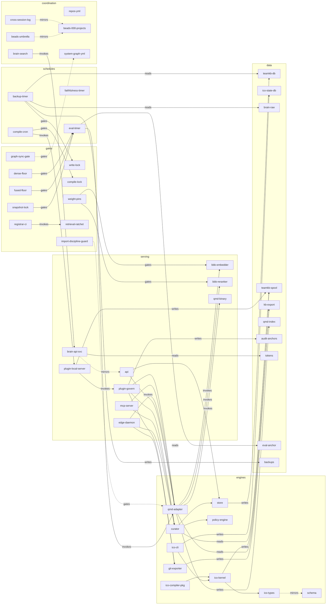

# System dependency graph — the machine-readable model of Bob's Big Brain

**Source of truth:** [`system-graph.yml`](../system-graph.yml) (repo root, next to `repos.yml`).
**This doc's diagram is generated** — the block between the AUTOGEN markers is written only by
[`scripts/render-system-graph.py`](../scripts/render-system-graph.py), and the
`system-graph-sync` CI job fails any PR where doc and model drift apart.

## What this is, and what it's called

`repos.yml` is the **inventory** (nodes: which repos exist, where). `system-graph.yml` is the
**model** (nodes *and* edges: what depends on, reads, writes, invokes, and gates what). Sessions —
human or LLM — load the YAML before wiring anything; this doc is the human-readable rendering.

The practice has names: keeping the architecture as a versioned, machine-readable model is
**architecture-as-code** (the same family as Backstage's software catalog and the C4/Structurizr
model-then-render approach); docs generated from the model rather than hand-drawn are **living
documentation**; and the CI job that fails when reality and model diverge is an **architectural
fitness function**. The estate already runs this discipline twice — the `005-AT-ARCH` §0
live-stats block and the `changelogs/` mirror — this is the third instance.

## How complicated is this system, really?

Measured (9-agent verified fan-out, 2026-08-03; edge spot-check 10/10 held): **86 nodes, 125
evidenced edges — verdict: moderate.** The split matters:

- **The core pipeline is genuinely simple**: capture → spool → govern (dedupe/policy/promote) →
  export → index → search, all over one directory (`~/.teamkb`), ~10 nodes end to end.
- **The operational shell is where the count lives**: 15 workspace packages + 6 apps across 3
  repos, the plugin coupled to the registrar tree via 8 `link:` deps (the graph models the 3 load-bearing ones as edges), 4 always-on services,
  a 4-stage nightly pipeline, 2 flocks, weight pins, and a CI ratchet that can only measure the
  synthetic corpus. The committed model curates this to ~50 load-bearing nodes.

## What this graph is for — and honestly, what it is not for

**It prevents design collisions and wiring misses.** Three apps construct `QmdAdapter`; the
serving config has exactly one owning locus (`qmd-adapter/src/config.ts getDefaultDenseConfig()`).
The #327/#328 duplicate PRs invented two different homes for that knob, and #327 missed the
MCP serving path entirely — a session that had loaded this graph would have seen both.

**It does not prevent concurrent duplicate work.** Verified against the actual #327/#328
timeline: both build windows closed before either session's first visible artifact. The root
cause was **cross-store bead routing** — one feature, two beads, two stores (`gybo.3` claimed in
the 000-projects store and mirrored to GH #326; `39z.6` unclaimed in the umbrella store) — and
`bd claim` cannot collide across stores. No static map fixes that; routing discipline does:
**one feature, one bead, one owning store**, and check
`bd list --label cross-session` (000-projects store) before engine-repo feature work.

## The nightly pipeline and lock contract

Previously documented only in comments spread across four scripts:

| When | What | Lock | Gate |
|---|---|---|---|
| 03:30 | compile cron (`teamkb-compile-daily.sh`, agent: minimax) | `.compile.lock` | C8 preflight; poison-pill retry |
| ~04:31 | `teamkb-backup.timer` (randomized) | `.write.lock` for the quiesce | per-run restore round-trip; off-host VPS+R2 |
| 05:00 | `bbb-eval-governed.timer` (main-pinned worktree) | — | snapshot SHA pin; fused + dense floors; degraded runs refuse a verdict |
| 05:45 Sun | `bbb-compile-faithfulness.timer` | — | — |

## Known gaps carried by the model (verified 2026-08-03)

- `eval-anchor/` (frozen snapshot + dense prebuilt — the eval's reproducibility root) and
  `corpus-machine/` are Tier B in the restore-tested brain archive as well as the dev-box borg
  chain. The backup gate checks their restored file counts when present.
- The ICO→schema vendored snapshot, deployed-copy API service, and repo↔`~/.config` unit copies
  are **manual lock-step mirrors** — each is a semantic (dotted) edge here so the drift risk is
  at least visible.
- `/usr/bin/ico` is a dangling symlink since the 2026-07-19 repo rename; local checkouts drift
  behind origin (this fan-out itself mis-reported the dense floor as missing because the local
  registrar tree was 3 commits behind — ground on `origin/main`, not the working tree).

## Regenerate / verify

```bash
python3 scripts/render-system-graph.py --write        # YAML → this doc's mermaid block
python3 scripts/render-system-graph.py --check        # CI mode: validate + sync check
python3 scripts/render-system-graph.py --check-local  # dev box only: units/cron/paths exist
```

Editing rules: change `system-graph.yml`, run `--write`, commit both. Every edge needs
`evidence` (derived: the mechanical fact; semantic: the guard that enforces the invariant).
An edge nobody can verify is an opinion, not a model.

<!-- AUTOGEN:system-graph — regenerated by scripts/render-system-graph.py; DO NOT hand-edit between the markers -->



_49 nodes · 50 edges (44 derived / 6 semantic) · solid = mechanically derived · dotted = hand-curated invariant_

<!-- /AUTOGEN:system-graph -->
